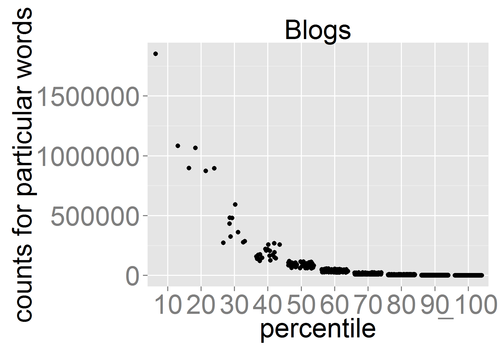
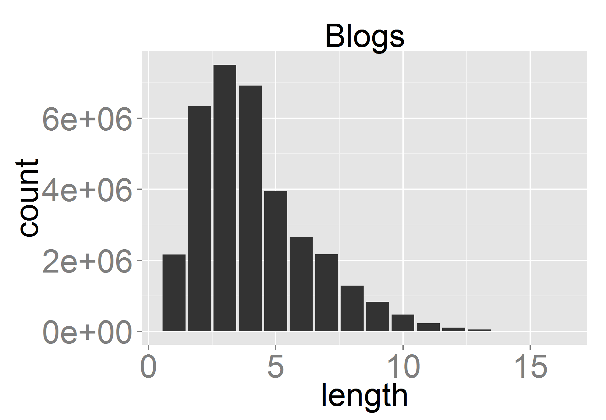
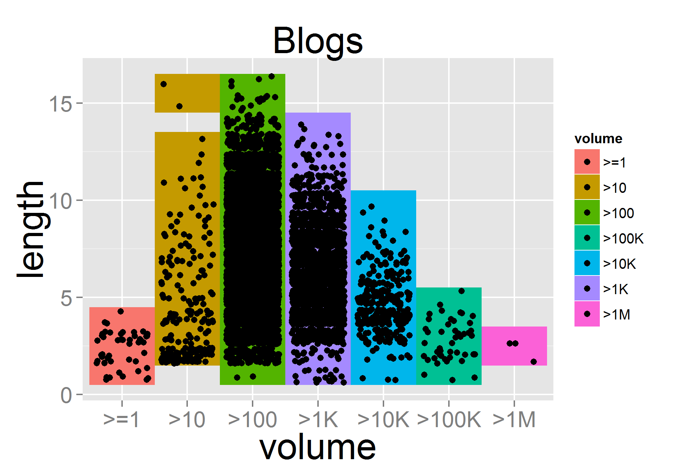
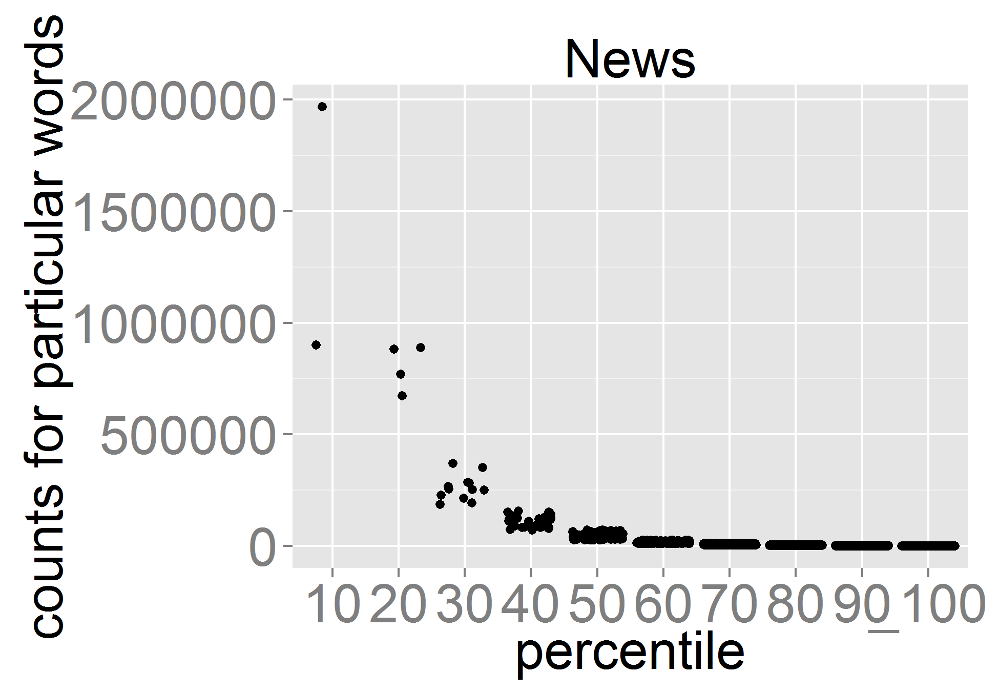
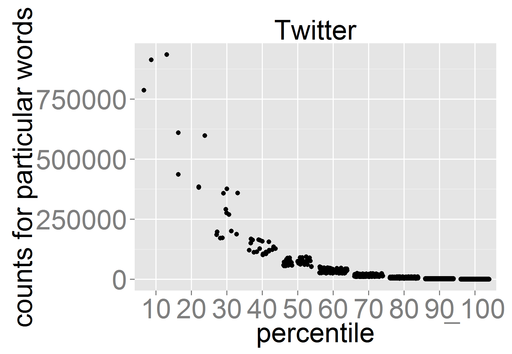
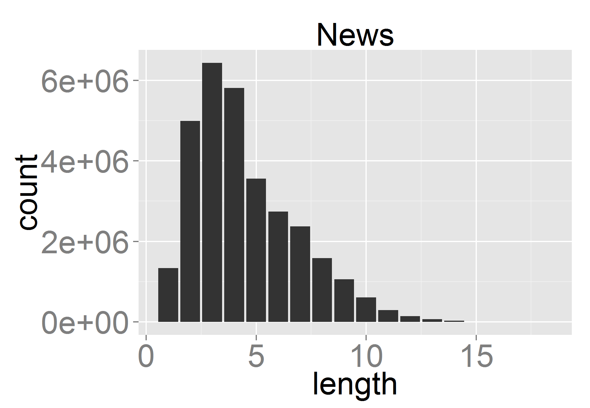
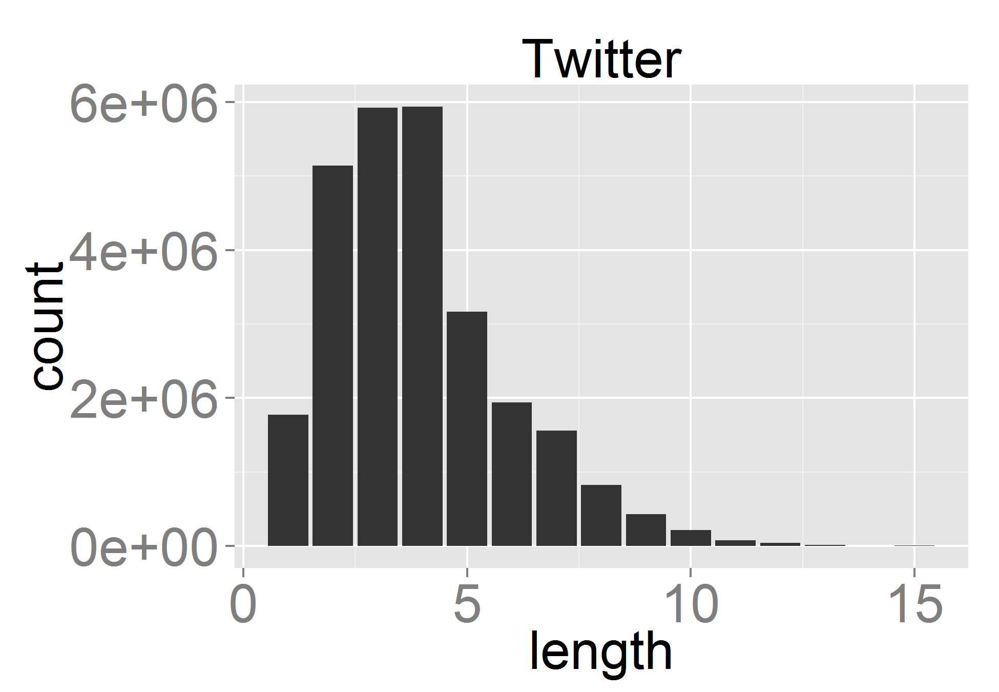
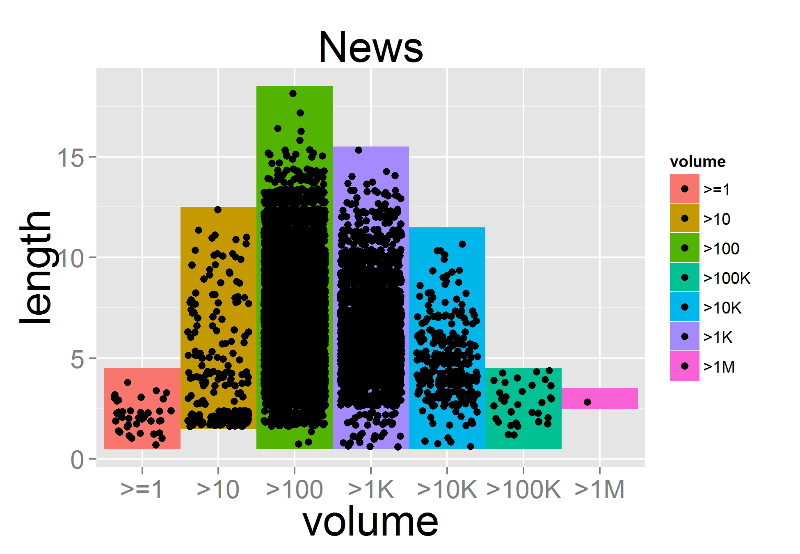

   
```{r include=FALSE} 
library(knitr)
library(modeest)
library(ggplot2)
library(gridExtra)
library(gridBase)
library(gridGraphics)

```


```{r include=FALSE}
options(digits = 2)
bu = read.table('buDF.csv', sep = ',', header=TRUE)
bu = bu[bu$count != 0,]
bu_words = sum(bu$count)
bu_unigrams = nrow(bu)
bu_min_instances = min(bu$count)
bu_max_instances = max(bu$count)
bu_mean_instances = mean(bu$count)
bu_median_instances = median(bu$count)
bu_mode_instances = mfv(bu$count)

bu_counts_names = c('>1M', '>100K', '>10K', '>1K', '>100', '>10', '>=1')

bu_counts_values = c(3,46,309,2730,11232,209,48)

x = data.frame(cbind(bu_counts_names,bu_counts_values))

```

```{r include=FALSE}
options(digits = 2)
nu = read.table('nuDF.csv', sep = ',', header=TRUE)
nu = nu[nu$count != 0,]
nu_words = sum(nu$count)
nu_unigrams = nrow(nu)
nu_min_instances = min(nu$count)
nu_max_instances = max(nu$count)
nu_mean_instances = mean(nu$count)
nu_median_instances = median(nu$count)
nu_mode_instances = mfv(nu$count)
```

```{r include=FALSE}
options(digits = 2)
tu = read.table('tuDF.csv', sep = ',', header=TRUE)
tu = tu[tu$count != 0,]
tu_words = sum(tu$count)
tu_unigrams = nrow(tu)
tu_min_instances = min(tu$count)
tu_max_instances = max(tu$count)
tu_mean_instances = mean(tu$count)
tu_median_instances = median(tu$count)
tu_mode_instances = mfv(tu$count)
```

<center><h2>Exploring words used by bloggers, tweeters, etc.</h2></center>

<br>
Author: Russ Robbins

<a href='https://github.com/robbinsr/exploring/blob/master/README.md'>Affiliated Code Repository (right click, and open new window or tab)</a>
<br>
<br>
<h4>Purpose of Document</h4>

The primary purpose of this document is to describe the structure of blogs, twitter, and news data. This data was distributed as text files on the Coursera Data Science Specialization course page. Further, this document reports interesting exploratory findings that will need additional confirmatory analysis. Finally, it shares my plans for creating a prediction algorithm as well as an affiliated Shiny app. 
<br>
<br>
<h4>Special Note</h4>

To keep the report brief, but also make the figures easily readable, only three figures are shown. These three figures focus on the blogs data set. For the interested reader, the appendix (which is NOT part of this brief report) has the comparable figures for news and twitter. 
<br>
<br>
<h4>Discussion</h4>

The analysis here focuses on three files: 

* en_US.blogs
* en_US.news
* en_US.twitter

This work is exploratory towards a more important goal. The overall goal of this project is to build a word prediction algorithm and encapsulate that model in a data product that will allow a user to understand how the algorithm can prospectively help SwiftKey. SwiftKey is a company that provides predictive technologies for easier mobile typing. The analysis shown here is expected to inform the algorithm that I am developing.

This document provides word counts, line counts, and other basic data that describes the information in the blogs, news, and twitter files. Further, it provides basic plots such as histograms to illustrate the features of the data.

To provide context, Three example "lines" from the files follow.

* We love you Mr. Brown. (blog)
* The Journal declined to comment. (news)
* Desk put together, room all set up. Oh boy, oh boy (twitter)

Table 1 shows the <strong> total </strong> number of lines and words in each of the files. It also shows the number of <strong> distinct </strong>  sets of one word and two, three, four, and five word phrases that were found in the data. In word prediction, these words/phrases are sometimes referred to as unigrams, bigrams, trigrams, 4grams, and 5grams. Examples of these types of ngrams follow.

* we (unigram)
* we love (bigram)
* we love you (trigram)
* we love you mr (4gram)
* we love you mr brown (5gram)

<center><h4>Table 1: Line, Word, and Ngram (distinct word) Counts</h4></center>
--------------------

```{r, echo=FALSE}
knitr::opts_chunk$set(cache=FALSE)
counts = data.frame()
line_1 = c('blogs','899,288', prettyNum(bu_words, big.mark=','), prettyNum(bu_unigrams, big.mark=','), prettyNum(29865, big.mark=','), prettyNum(13581, big.mark=','), prettyNum(2053, big.mark=','), prettyNum(217, big.mark=',')) 
line_2 = c('news', '1,010,242', prettyNum(nu_words, big.mark=','), prettyNum(nu_unigrams, big.mark=','), prettyNum(28842, big.mark=','), prettyNum(10087, big.mark=','), prettyNum(1245, big.mark=','), prettyNum(153, big.mark=','))
line_3 = c('twitter', '2,360,148', prettyNum(tu_words, big.mark=','), prettyNum(tu_unigrams,big.mark=','), prettyNum(153, big.mark=','), prettyNum(9570, big.mark=','), prettyNum(1527, big.mark=','), prettyNum(190, big.mark=','))
first = rbind(line_1, line_2, line_3)
counts = first
colnames(counts) = c('','lines', 'words', 'unigrams', 'bigrams', 'trigrams', '4grams', '5grams')
row.names(counts) = c(1, 2, 3)
kable(counts)
```

In Table 1, note that the bigrams are roughly double the number of unigrams and then the trigrams, 4grams, and 5grams get progressively smaller. This was different than I expected since as you add more possible combinations the numbers of each ngram you get more possibilities. However, this "more possibilities" idea implies that words are not interdependent upon each other, which we know is not the case (e.g., a noun needs a verb, adjectives/adverbs are modifiers of other words). This implies to me that, at least as represented by this data, the "vocabulary" of phrases that is common across the persons who blogged, wrote news, or tweeted is limited. This is helpful as the course product is focused on predicting words in phrases.
<br>
<br>

<center><h4>Table 2: Statistics for Counts of Unigrams (distinct words)</h4></center>
--------------------

```{r, echo=FALSE}
knitr::opts_chunk$set(cache=FALSE)
knit_hooks$set(inline = function(x) {
  prettyNum(x, big.mark=" ")
})
options(digits = 2, OutDec = ".")
stats = data.frame()
line_1 = c('blogs',bu_min_instances, prettyNum(bu_max_instances, big.mark=','), prettyNum(bu_mean_instances, big.mark=',') , bu_median_instances, bu_mode_instances)
line_2 = c('news', nu_min_instances, prettyNum(nu_max_instances, big.mark=','), prettyNum(nu_mean_instances, big.mark=','), prettyNum(nu_median_instances, big.mark=','), nu_mode_instances)
line_3 = c('twitter', tu_min_instances, prettyNum(tu_max_instances,big.mark=','), prettyNum(tu_mean_instances,big.mark=','), prettyNum(tu_median_instances, big.mark=','), tu_mode_instances)
first = rbind(line_1, line_2, line_3)
stats = first
colnames(stats) = c('','min', 'max', 'mean', 'median', 'mode')
row.names(stats) = c(1, 2, 3)
kable(stats)
```

Another way to describe the data is to understand the number of instances of unigrams in general. Table 2 shows the minumum, maximum, mean, median, and mode number of instances for particular unigrams in the blogs, news, and twitter data. You will notice that there is a large range in the number of times that a unigram can occur in either the set of blogs, the set of news, or the set of twitter lines. For example, certain unigrams, such as the word 'the' appear a very large number of times (e.g., in the blog data it occurred 1,852,821 times). Therefore a description of how the high usage of certain words can dominate the actual number of words used is in order. 

<br>

<center><h4>Table 3: Small Number of Unigrams Used Frequently</h4></center>
--------------------
```{r, echo=FALSE }
cov = data.frame()
line_1 = c('blogs',2, 15, 74, 426, prettyNum(1131, big.mark=','))
line_2 = c('news', 2, 19, 118, 745, prettyNum(1704,big.mark=','))
line_3 = c('twitter', 3, 21, 79, 325, prettyNum(755,big.mark=(',')) )
first = rbind(line_1, line_2, line_3)
cov = first
colnames(cov) = c('','10%', '30%', '50%', '70%', '90%')
row.names(cov) = c(1, 2, 3)
kable(cov)
```

One way to do this is to show how many unigrams it takes to cover a range of percentiles of the unigrams actually used. Table 3 shows this information. Table 3 can be read as follows. (I'll use the first part of the first line to explain.) In the blogs, three unigrams (specifically, "the", "and", "to") occurred so often that the number of times these occured accounted for 10% of all occurrences of unigrams in the blogs. While this is very interesting, the far right of the first line provides even more interesting information. If you move to the right of Table 3, you will see that for blogs, 1131 unigrams accounted for 90% of the uses of unigrams. However, a total of 14577 unigrams were used across all blogs. Put another way, 7.8% of the unigrams (again, distinct words) accounted for 90% of the uses of unigrams. Similar findings occurred for news and twitter. Figure 1 shows this information graphically. Figure 1 presents counts of unigrams (each point represents a distinct word) for the 10th through 100th percentiles. 
<br>
<br>
<center><h4>Figure 1: Unigram Counts Filling Percentiles</h4></center>
-----------
```{r include=FALSE}

#percentile by count
cpb = qplot(percentile, count, data=bu, geom=c("jitter"), main="Blogs", xlab="percentile", ylab="counts for particular words")   + scale_x_discrete(limits=c('10','20','30','40', '50', '60', '70', '80', '90', '_100')) + theme(axis.text=element_text(size=25), axis.title=element_text(size=25)) + theme(plot.title = element_text(size=25))
ggsave('cpb.png')

cpn = qplot(percentile, count, data=nu, geom=c("jitter"), main="News", xlab="percentile", ylab="counts for particular words")   + scale_x_discrete(limits=c('10','20','30','40', '50', '60', '70', '80', '90', '_100')) + theme(axis.text=element_text(size=25), axis.title=element_text(size=25)) + theme(plot.title = element_text(size=25))
ggsave('cpn.png')

cpt = qplot(percentile, count, data=tu, geom=c("jitter"),  main="Twitter", xlab="percentile", ylab="counts for particular words")   + scale_x_discrete(limits=c('10','20','30','40', '50', '60', '70', '80', '90', '_100'))+ theme(axis.text=element_text(size=25), axis.title=element_text(size=25)) + theme(plot.title = element_text(size=25))
ggsave('cpt.png')

```


  
Another way to describe the features of the blogs, news, and twitter files is to study the length of the unigrams that were used in these online sites. Again, these three types of shows similarity. Unigrams that have lengths of three are the most frequent, and in the case if twitter unigrams of four letters are also very frequent. Understanding unigram length may be important for developing and using an algorithm that runs as a user types a word. Using information about the distribution of the length of words in general can suggest when a user is likely to stop typing a word, and thus, how close the algorithm's current understanding of the word (e.g. "lov") is to the actual word ("love"). This in turn can allow the algorithm to begin focusing on other aspects of the prediction problem. Figure 2 presents a histogram of word lengths for blogs.
<br>
<br>


<center><h4>Figure 2: Unigram Counts by Word Length</h4></center>
-------------
```{r include=FALSE}
#count by length
clb = ggplot(data=bu,  aes(x=length, y=count)) +
    geom_bar(stat="identity") + ggtitle("Blogs")  + theme(axis.text=element_text(size=25), axis.title=element_text(size=25)) + theme(plot.title = element_text(size=25))
ggsave('clb.png')
cln = ggplot(data=nu, aes(x=length, y=count)) +
    geom_bar(stat="identity") + ggtitle("News")  + theme(axis.text=element_text(size=25), axis.title=element_text(size=25)) + theme(plot.title = element_text(size=25))
ggsave('cln.png')
clt = ggplot(data=tu, aes(x=length, y=count)) +
    geom_bar(stat="identity") + ggtitle("Twitter")  + theme(axis.text=element_text(size=25), axis.title=element_text(size=25)) + theme(plot.title = element_text(size=25))
ggsave('clt.png')
```


<br>
<br>

Finally, Figure 3 shows similar information but instead of using count data to create a histogram, the data is categorized into ranges (e.g., "between 1 and 9 words", "over 1 million words") and these ranges are used to show the dispersion of the actual unigrams in those ranges. The x-axis has categories that indicate the number of instances a unigram had. The y-axis indicates for each of those words, its respective length. Looking at the first column we can see that for unigrams that occured between 1 and 9 times, their lengths ranged from 1 to 4 letters. Similarly (on the far right of the figure) we can see that words that were used more than 1 million times either had a length of 2 or 3. This corresponds to the "the", "and", and "to" mentioned above. Places in the columns were the dots are more dense implies that many more words were at that intersection of volume and length. 

<center><h4>Figure 3: Unigram Lengths by Volume</h4></center>
---------------
```{r include=FALSE}
#volume by length
vlb = qplot(volume, length, data=bu, geom=c("tile", 'jitter'), fill=volume,main="Blogs", ylab="length") + scale_x_discrete(limits=c('>=1','>10','>100','>1K', '>10K', '>100K', '>1M')) + theme(axis.text=element_text(size=15), axis.title=element_text(size=25)) + theme(plot.title = element_text(size=25))
ggsave('vlb.png')
#volume by length
vln = qplot(volume, length, data=nu, geom=c("tile", 'jitter'), fill=volume,main="News", ylab="length") + scale_x_discrete(limits=c('>=1','>10','>100','>1K', '>10K', '>100K', '>1M'))  + theme(axis.text=element_text(size=15), axis.title=element_text(size=25)) + theme(plot.title = element_text(size=25)) 
ggsave('vln.png')
#volume by length
vlt = qplot(volume, length, data=tu, geom=c("tile", 'jitter'), fill=volume,main="Twitter", ylab="length") + scale_x_discrete(limits=c('>=1','>10','>100','>1K', '>10K', '>100K', '>1M'))  + theme(axis.text=element_text(size=15), axis.title=element_text(size=25)) + theme(plot.title = element_text(size=25))
ggsave('vlt.png')
```



I plan to focus my efforts predicting phrases that include the most common words, since it is likely these will be the words selected by future prospective users. Further I plan on using classic approaches to predicting ngrams. These approaches include conditional probability, smoothing, and interpolation/backoff. Conditional probability refers to how likely a word is given the previos word, Smoothing addresses the likelihood of words that were not in the data we used to compute conditional probabilities. Interpolation/backoff is the process of using subsets of our current ngram to predict the next word. 

If I am successful using classic Ngram prediction methods, I may also look into part of speech tagging and test whether knowing a words part of speech (e.g., adjective) is helpful for filtering the set of possible next words. Concurrently I plan to refamiliarize myself with Shiny, and build a skeleton app that addresses space and computation constraints imposed by using the Shinyapps platform. I think I will also investigate using Python for NLP to supplement R's capabilities, if necessary. 

If you could provide your thoughts on this work and my plan I would be very appreciative. Thank you so much for taking the time to review and react to this report.


Appendix:
=========

This appendix is not part of the report but it is included in case anyone wants to look at comparable charts for news and twitter.







